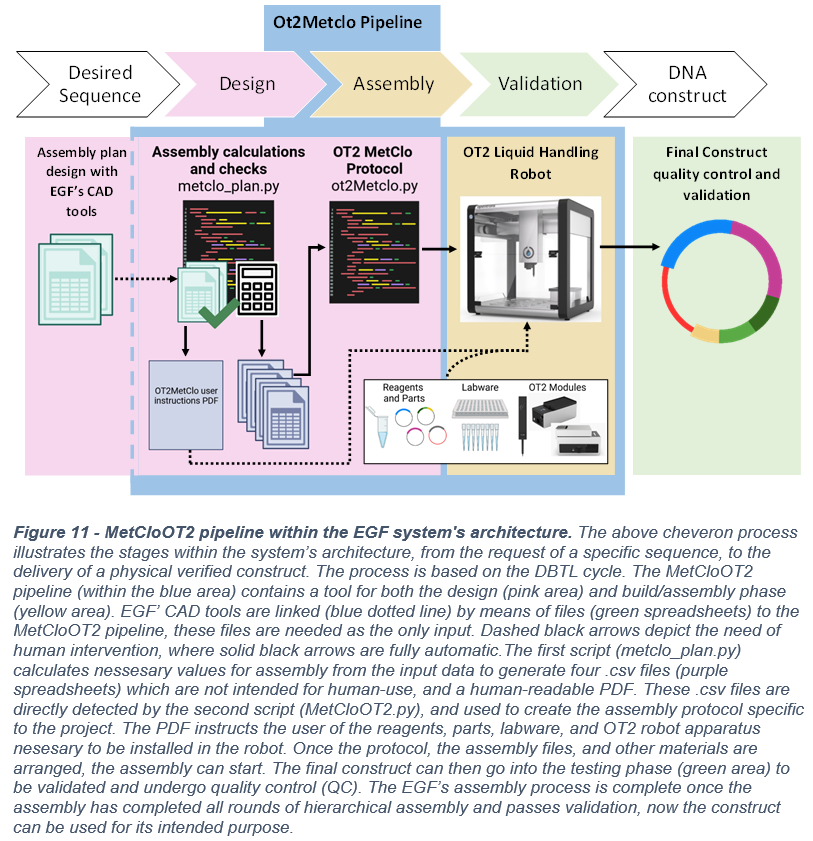

# MetCloOT2: an automated DNA assembly framework for the Edinburgh Genome Foundry

## Abstract

The essential use of novel genetic constructs provides unique behaviours and functionalities to biological systems, aid biological research, and advances the field of biotechnology and synthetic biology. MetClo is a hierarchical DNA assembly method derived from Golden Gate assembly. It uses a vector-set framework for DNA assembly.  It uses a single type of type IIS restriction enzyme sites regulated by methylation, and a predetermined overhang set. Multiple standardised DNA assembly methods, including MetClo, have been developed to have consistent design patterns, standardized steps, and predictable results. These traits permit the translation of laboratory protocols into computer aided design (CAD) software and automation script. Biofoundries, such as the Edinburgh Genome Foundry (EGF), are established on engineering principles and consequently provides design and automated build support to normal molecular laboratories that cannot obtain such infrastructures. Such automation platforms include the Opentrons OT2 liquid handling robot, an economic and versatile device capable of conducting molecular biology protocols. To aid in the expansion of the foundry’s capabilities and the democratisation of high throughput assembly technology, the MetCloOT2 pipeline was created to modularly fit into the EGF’s established DNA assembly system. All novel protocols, hardware or software entering the foundry’s system needs to be scrutinised to assure that only vetted operations are used. The MetClo kit was simulated, and its overhang collection was validated using various EGF’s CAD software. A MetClo kit specific CAD capable of calculating all reagents and part volumes as well as allocating them positions within the OT2 was developed. It can work independently or in conjugation with a MetClo protocol generator. The generator was developed to streamline and automate the MetClo assembly on the OT2. The software, called MetCloOT2 can be found within its GitHub repository. 
https://github.com/Edinburgh-Genome-Foundry/OT2Metclo

  
  

