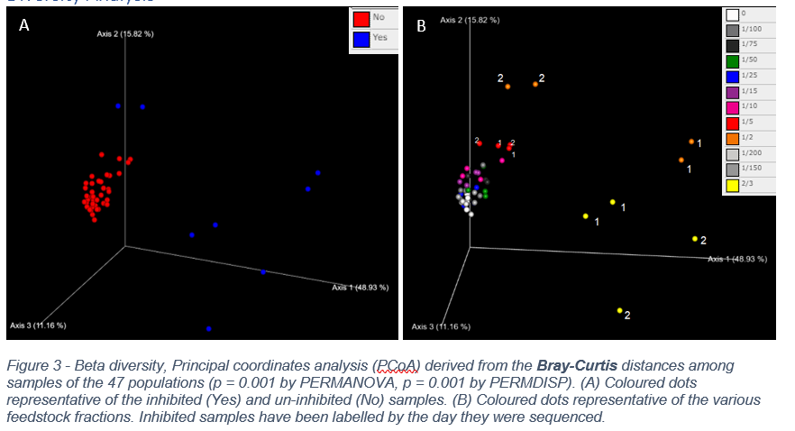

# Metataxonomic Analysis of the Anaerobic Digestor Organic Overload 

This paper demonstrates the results of a metataxanomic analysis of industrial-scale AD reactor samples from the WWTP that was loaded with increasing ratios of feedstock. 

## Abstract

### Introduction

Anaerobic digestors (AD) are enclosed systems which contain a microbiome capable of digesting/breaking down organic components (organic polymers) in the absence of oxygen. These systems yield biogas, such as methane, and nutrient rich digestate. An AD are of importance as an efficient method of extracting energy and other valuable products from organic waste and aid the circular economy1,2. The AD's yield is sensitive to the microbial diversity, process parameters and organic matter loaded into the reactor 2,3.This analysis report examines the metataxonomic of ADs with changing organic overloads and the effect it has on biogas production and population differences among the samples. Additionally, the report suggests taxonomic biomarkers indicative of the health of an AD. 

### Methods
The16Sr RNA was sequenced from digestates obtained from industrial-scale AD reactors at the Sea Wastewater Treatment Plant (WWTP) by the Edinburgh Genome Foundry using an Illumia MiSeq System. The AD samples were feed varying ratios of feed stock and sequenced. The experiment was repeated on the same samples and sequenced once again at a later date (4-5 weeks). The experimental sample set up is shown in Supplementary Table 1. The methane production of the varying feed-stock samples is measured. The QIIME2 workflow was employed to analyse the sequence data and ultimately produce taxonomic classification using the Silver 138 database, alpha and beta diversity analysis, and ANCOM analysis. Detailed information about the workflow can be found at QIIME 2.org and in Supplementary Fig1.

### Conclution
The alpha diversity study shows that overloading a reactor over a long period of time will cause inhibition, decreasing diversity and lower production of biogas. There are clear taxonomic differences between , there seems to be a feedstock threshold which permits Inhibited reactors can become taxanomically similar to un-inhibited reactors past a feedstock threshhold as time progresses, this would be an interesting area for further investigation, as unhealthy and high opreforming AD can be regained. Various taxonomic markers were identified to indicate the constitution of the reactor. Species such as (but not limited to) Pseudomonadaceae Thiopseudomonas, Rikenellaceae, Oligosphaeraceae Z20, Pseudomonadaceae Pseudomonas, Spirochaetaceae Treponema and Ruminococcaceae can indicate that a reactor may be overloaded. Similarly, there are microbial species which are associated with healthy AD reactors, these are found in the result section. AD reactors are sensitive to organic overloading. Reactor’s alpha and beta diversity are shown to change with various feedstock loads, and essentially cause changes in biogas production. Microbial populations can be analysed and compared to the biomarkers identified within this paper to determine the health of the AD reactors.

